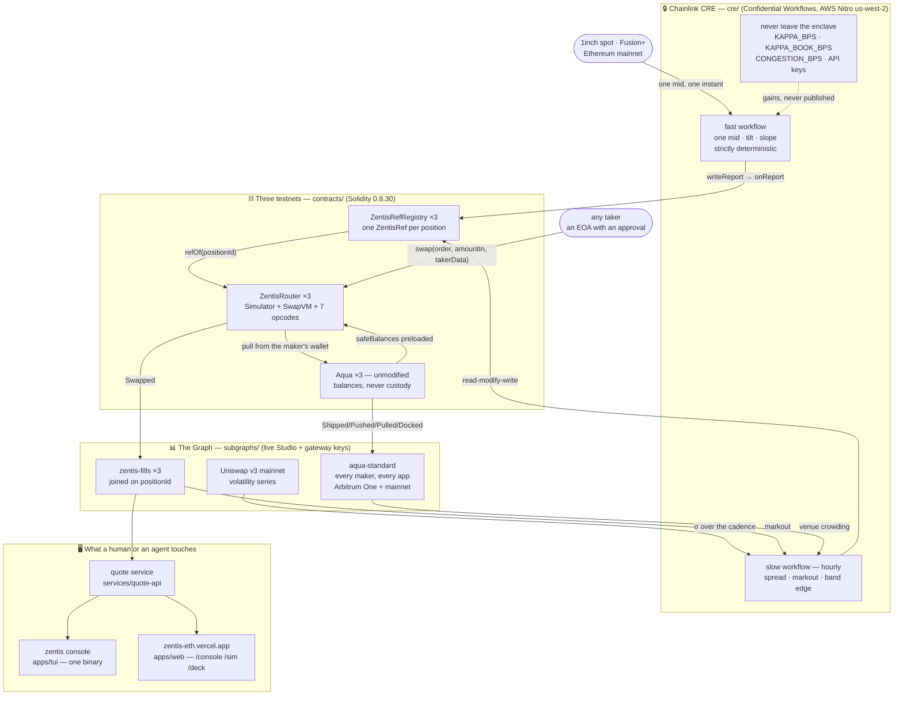
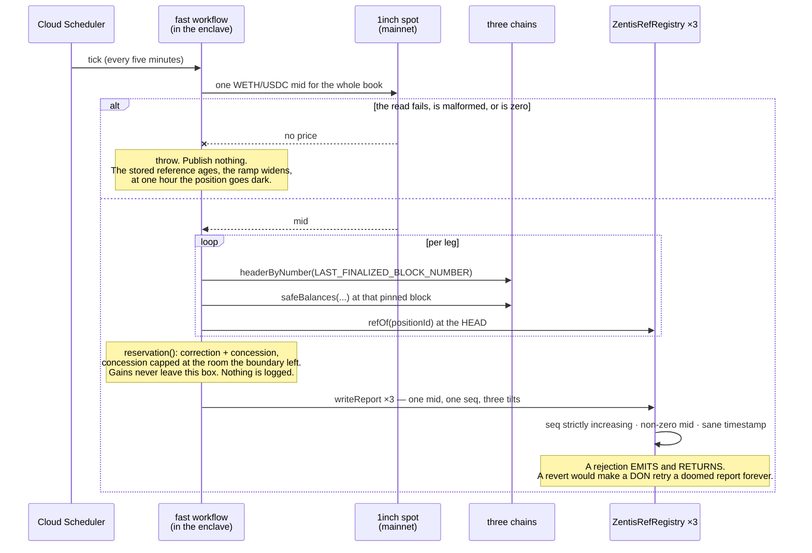
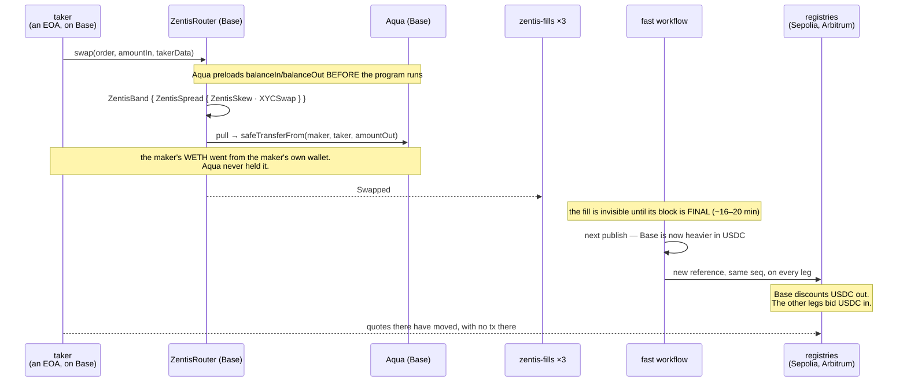
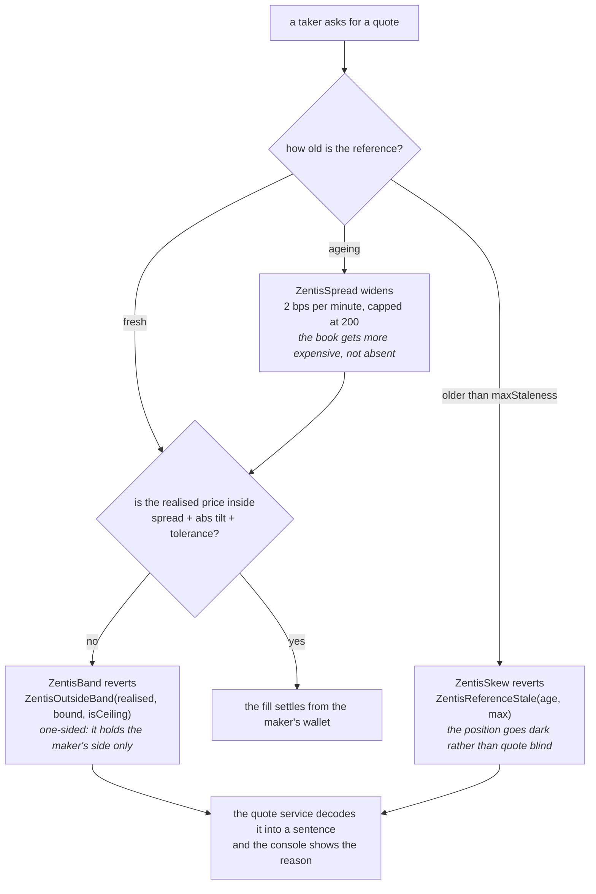

<div align="center">


# ZENTIS

### **One market-making position on three chains — one mid everywhere, no bridge anywhere**

<br>

[](./LICENSE)
[](#deployed-contracts)
[](#repository-layout)
[](./1inch.md)
[](./thegraph.md)
[](./chainlink.md)

<br>

**[Background](#the-background)** · **[What it does](#what-it-does)** · **[Install](#install)** · **[Architecture](#architecture)** · **[Flows](#flow--one-mid-three-legs-one-instant)** · **[Contracts](#deployed-contracts)** · **[Instructions](#the-three-instructions)** · **[Subgraphs](#subgraphs)** · **[Where it lives](#where-it-lives)** · **[Not built](#what-is-deliberately-not-built)** · **[Develop](#continuing-development)** · **[License](#license)**

<br><br><br>
</div>

**Zentis** is one market-making position whose inventory lives on **three chains at once**. Every leg
quotes off the *same* mid, published at the same instant by a **Chainlink Confidential Workflow**, and
the book's inventory is managed as a single book — **without bridging**. Nothing crosses a chain
boundary but a signed number.

The position is three custom **SwapVM instructions** running on official, unmodified **1inch
Aqua/SwapVM** contracts. The reference they price from is computed inside a TEE, so the maker's
aggression — the gains that turn inventory into a quote concession — never leaves the enclave. The
history the whole thing is measured against comes from **The Graph**: a standardized schema for Aqua
maker positions that nobody had written, plus a fills subgraph on each testnet.

Funds never leave the maker's wallet. Aqua records a balance and pulls at settlement, so `ship()` and
`dock()` move no tokens at all — that is not a slogan, it is a property we read off the chain.

---

## Sponsor integrations

One file each, pointing at the exact code behind every claim.

| Sponsor | Track | Writeup |
|---|---|---|
| **1inch** | Build an Aqua App | [`1inch.md`](./1inch.md) |
| **The Graph** | Composable / Standardized Graph Products | [`thegraph.md`](./thegraph.md) |
| **Chainlink** | Best Confidential Workflow | [`chainlink.md`](./chainlink.md) |

Developer-experience feedback for all three — eleven reproduced bugs, two filed upstream with one PR
open against the Chainlink SDK — is in [`FEEDBACK.md`](./FEEDBACK.md).

---

## The Background

A maker running the same pair on three chains is running three businesses that cannot see each other.
When one leg gets bought out, the textbook fix is a round trip: sell the asset here, bridge the
stablecoin, buy it back there. That costs three ways — you wait for the transfer, you pay fees on both
sides, and while the value is in flight it is on neither leg.

The bridge fee is not really the problem. The problem is that a market maker exists to *earn* the
spread, and the bridge route makes it cross the spread as a taker, twice, to fix its own inventory.

**Zentis does not move the money. It moves the price, and no money needs to move at all.**

1. **One mid, one book — the foundation.** A confidential workflow reads one real WETH/USDC mid from
   Ethereum mainnet and writes it to all three registries under one `seq`, at one instant. Every leg
   then anchors its own constant-product curve back onto that mid. Before this existed, three
   unarbitraged testnet pools quoted the same pair at 30,187, 4,156 and 2,583 USDC per WETH — and a
   book weight measured against one is not comparable with a weight measured against another.

2. **A correction and a concession — the signal.** Each leg's quote shifts off the mid by two terms
   with different justifications. The **correction** (`(1−2w)/w`) reprices the leg's own curve onto the
   mid; it is not a cost the maker chooses to pay. The **concession** (own-leg and book skew) is what a
   leg pays to shed what it holds too much of, and it is capped by what bridging would actually have
   cost — priced from a real 1inch **Fusion+** quote. Pricing never costs more than the bridge it
   replaces. This is Avellaneda–Stoikov's reservation price expressed as a SwapVM tilt, with Guéant's
   multi-position term on top.

3. **The reference cannot drain the position — the safety.** The tilt is applied to `balanceIn` only,
   never `balanceOut`. Since `amountOut = amountIn·balanceOut/(balanceIn′+amountIn) < balanceOut` for
   any `balanceIn′ > 0`, a quote can never exceed the maker's real Aqua balance **regardless of what
   the feed says**. No clamp, no post-check, no revert at settlement: the failure is *unreachable*
   rather than guarded. `ZentisBand` then bounds the realised price against the reference, and a
   published boundary can only ever **narrow** the cap the maker signed, never widen it.

The classical cases all degenerate correctly. One chain → the book term is zero. Gain at 40,000 →
reproduces a plain constant-product curve to within rounding. Budget zero → three independent pools.

---

## What it does

You install a single binary, point it at a key file, and watch — or run — a live cross-chain position:

> *"Quote the same mid on three chains, let takers rebalance me, and never let pricing cost more than
> a bridge would have."*

- A **publish** reads one mainnet mid inside the enclave and writes a reference to all three
  registries under one `seq`, with per-leg tilts that differ only because the legs hold different
  inventory at that one price.
- A **fill** on any leg prices through `ZentisSkew → XYCSwap` wrapped by `ZentisSpread` and
  `ZentisBand`, against the maker's real Aqua balances.
- **A fill on one chain moves the other legs' quotes** at the next publish, with no transaction on
  those chains and nothing bridged. Measured: **+34.9 bps** on Arbitrum after a 4 USDC fill on Base.
- A **refusal** is a real answer. The band declining a direction, the staleness ramp widening a quote,
  the reference going dark after an hour — each surfaces as a decoded sentence, not an opaque revert.
- A **top-up** (`push()`) re-sits a leg's curve on the mid with no dock and no re-ship, and no token
  crosses a chain boundary to do it.
- The **console** shows the shift decomposed into correction, concession and book concession, the
  spread stack, the boundary, and recomputes the enclave's own number beside the published one.
- The **quote service** answers per-chain quotes over HTTP with `seq`, the tilt, the reason, and
  `_meta` from every indexer it read.

---

## Install

The console ships as one compiled binary for **macOS and Linux**, x64 and arm64. It carries its own
signer, so there is no toolchain to install — no Foundry, no Node, nothing.

```bash
curl -fsSL https://zentis-eth.vercel.app/install.sh | bash
```

It detects your platform, downloads the matching asset and `checksums.txt` from the
[GitHub release](https://github.com/xavio2495/Zentis/releases), verifies the checksum, installs to
`~/.local/bin/zentis`, and prints one line. It never edits shell rc files and refuses to run as root.

```bash
zentis                 # interactive console
zentis watch           # read-only; drops the env file whatever the environment says
zentis --version
zentis update
```

First run in a fresh `$HOME` opens onboarding: generate a wallet (written to `~/.zentis/wallet.env`,
mode 600, the address printed and the key never shown), point at an existing env file, or go
watch-only. Role is **inferred from the address** — the book's maker gets `push`, anyone else is a
taker and gets quote and fill.

| Key | Does |
|---|---|
| `1` `2` `3` · `←` `→` `enter` | open a leg's detail — the shift decomposed, the spread stack, the reference |
| `q` | re-quote every leg now |
| `f` | take the Sepolia leg's quote *(confirmed, then signed by a child process)* |
| `p` `n` `w` `m` `d` `l` | positions · profit and loss · wallet · simulation · status · transaction log |
| `t` | chart window: 1h, 24h, 7d, automatic |
| `:` | `fill` · `quote` · `approve` · `republish` · `rebalance` · `push` · `window` · `page` |
| `?` · `x` | help and every disclosure · quit |

**The interactive process never holds a key.** Everything that signs runs as `zentis sign`, a child of
the same binary, with the intent on **stdin** so it is never an argument `ps` could show. Every path
out of that child passes through one `redact` funnel.

---

## Architecture



**The rule the whole design follows:** *the number that prices a trade may be public; the model that
produced it may not.* Where a market is public market structure, the enclave publishes. Where it is
the maker's edge, the enclave keeps it and publishes only the scalar that has to be read on chain.

### Who holds what

| Where | Holds | If it is compromised |
|---|---|---|
| **The maker's wallet** | every token, always | it is the maker's own key — nothing else custodies anything |
| **Aqua** | a recorded balance, and an approval to pull at settlement | it can pull at most what the maker approved; its own token balance is zero |
| **The enclave** | the gains, the API keys, the Fusion+ payload | the maker's aggression leaks — which is why it is the one thing that is secret |
| **`ZentisRefRegistry`** | one `ZentisRef` per position | a false reference moves the price *within the band* and no further; `balanceOut` is never touched, so over-quoting stays unreachable |
| **The instruction immediates** | `maxTiltBps`, the staleness limit, the ramp | signed by the maker; a published boundary can only narrow them |
| **The console** | nothing. It spawns a child that reads one key file | nothing to take — `ps` never sees a key and every output path is redacted |

---

## Flow ① — One mid, three legs, one instant



The pricing inputs are pinned to each chain's finalized block; only the reference slot itself is read
at the head. That is what makes two runs over the same block produce byte-identical reports — asserted
by test, because with no attestation, determinism is the only evidence these workflows are
enclave-shaped.

## Flow ② — A fill on one chain moves the other legs

This is the flow the whole design exists for. **No transaction is sent on the legs that move.**



**Measured on chain, not asserted.** A 4 USDC fill on Base left that leg 69.2% USDC against Arbitrum's
54.8%. The next published reference carried **+36 bps on Base and −36 bps on Arbitrum**, and the same
1 USDC quote on Arbitrum went from `382,760,074,316,830` to `384,096,652,134,317` wei WETH — **+34.9
bps, with no Arbitrum transaction in between.** Recorded in
[`contracts/deployments/arbitrum-sepolia.json`](./contracts/deployments/arbitrum-sepolia.json)
under `crossChainEffect`.

## Flow ③ — Refusing, and widening before going dark



Every one of the sixteen `error Zentis*` declarations is decoded by
[`services/quote-api/src/refusal.ts`](./services/quote-api/src/refusal.ts) into an operator sentence,
and the endpoint predicts a refusal from indexed state *before* the router makes it. A refusal is the
product working, so it is surfaced as a caveat rather than swallowed as an error.

---

## Deployed contracts

Three legs of **one position** — identical `positionId`
`0x…0001`, different `strategyHash` per chain, because `chainSalt` is what separates the legs. Pair is
USDC (6dp) / WETH (18dp) on every chain, USDC lower-addressed and therefore `tokenA`.

### Sepolia · 11155111

| Contract | Address |
|---|---|
| `ZentisRefRegistry` | [`0xA5dCB9B329b17253FF35202dEb7a2093d06fd7b0`](https://sepolia.etherscan.io/address/0xA5dCB9B329b17253FF35202dEb7a2093d06fd7b0) |
| `ZentisRouter` | [`0x57706A10f41d4649fE65de6D38c3eCe429D2d147`](https://sepolia.etherscan.io/address/0x57706A10f41d4649fE65de6D38c3eCe429D2d147) |
| `AquaRouter` (pinned `aqua@9c5c42e`, unmodified) | [`0xF86CdAeE90DB9901a5F104172294161085070C5A`](https://sepolia.etherscan.io/address/0xF86CdAeE90DB9901a5F104172294161085070C5A) |

`strategyHash` `0x212fec3f6b034be64fe532eab6585d962348c9d3900f828d10e493dd4407399b` · ship tx
[`0xd5087f6f…62f99c89`](https://sepolia.etherscan.io/tx/0xd5087f6f6bdd076903b7fffb3bfe834c4235d227687b35d5d9bbd2dd62f99c89) ·
fill [`0xf82db8a3…56ff1630`](https://sepolia.etherscan.io/tx/0xf82db8a3fdcd408b8e649db42bafacf06773fa08a5db3a528fc0f7e056ff1630) (0.15 USDC → 4,009,890,146,858 wei WETH)

### Base Sepolia · 84532

| Contract | Address |
|---|---|
| `ZentisRefRegistry` | [`0x2FE4cCe316287505ce114101b9d58c1f56d8E910`](https://sepolia.basescan.org/address/0x2FE4cCe316287505ce114101b9d58c1f56d8E910) |
| `ZentisRouter` | [`0xdd9752b377870bd9e41cd041f4a0e90770d0fb41`](https://sepolia.basescan.org/address/0xdd9752b377870bd9e41cd041f4a0e90770d0fb41) |
| `AquaRouter` | [`0xb8790fd154f3c36c4d83e6e59f0550bae7cceff9`](https://sepolia.basescan.org/address/0xb8790fd154f3c36c4d83e6e59f0550bae7cceff9) |

`strategyHash` `0x6c034027e9e42b1c0aa9a1d3aa21e5dc08cf94e0322ea539ea78e5ea707f18db` · ship tx
[`0x5e8c58b9…917fd9ad`](https://sepolia.basescan.org/tx/0x5e8c58b92ab5831372b1ad70477b689e10f0587059b4974c4f1d66f8917fd9ad) ·
fill [`0xba18f835…206a902`](https://sepolia.basescan.org/tx/0xba18f835b38a2e8d82e47c748c9d7bae77791f6a5e7cd7ff98cd46603206a902)

**The CRE write path, exercised on chain before any workflow existed:** a well-formed report through
`onReport` wrote the reference ([`0x5a4336bb…d4aa1231`](https://sepolia.basescan.org/tx/0x5a4336bb0df17a161c05d7e882b860272a0047cb9398960b124f2d3ad4aa1231)),
and **replaying the same report did not revert** ([`0x1f44eda1…511030c6`](https://sepolia.basescan.org/tx/0x1f44eda1b0d5919541b1e0aad7479083e2dfbaa03e6e3e534ab289df511030c6),
status `0x1`) — it emitted `ZentisRefRejected(id, "stale seq")` and left the stored reference alone.

### Arbitrum Sepolia · 421614

| Contract | Address |
|---|---|
| `ZentisRefRegistry` | [`0xB7e37E396bBB785c346D1909231a9B3D2707Cd32`](https://sepolia.arbiscan.io/address/0xB7e37E396bBB785c346D1909231a9B3D2707Cd32) |
| `ZentisRouter` | [`0xfc603336a7b797f2d7eba03ed69734fad9ea521b`](https://sepolia.arbiscan.io/address/0xfc603336a7b797f2d7eba03ed69734fad9ea521b) |
| `AquaRouter` | [`0x8f4f807c72a2bfab4024e783f68fc714d0ce2bbe`](https://sepolia.arbiscan.io/address/0x8f4f807c72a2bfab4024e783f68fc714d0ce2bbe) |

`strategyHash` `0xd37a493e8ba6bd3890c52520c0cfabb2e7a3026ee0eb57ecdc693e4830825190` · ship tx
[`0x06ea00dd…f4f088c0`](https://sepolia.arbiscan.io/tx/0x06ea00dd6715866fcf51939fb765e010775547509462b1af381a4ab1f4f088c0) ·
fill [`0xeefe0230…e5a94307`](https://sepolia.arbiscan.io/tx/0xeefe0230ec144fd88008053444a3ecfb2ba7a7bd2e854c9849bfed82e5a94307)

> Arbitrum's `ZentisRouter` and Base's **superseded** `ZentisRefRegistry` share an address: same
> deployer, same nonce, different chains. They are different contracts.

**The venue is self-deployed from pinned source**, because canonical Aqua addresses are mainnet-only.
Every deployment record, every superseded generation and every fill is in
[`contracts/deployments/`](./contracts/deployments) — and every hash there was resolved from an
on-chain receipt, never from its position in `forge`'s `run-latest.json`, which does not align
`transactions[].hash` with its own function labels.

---

## The three instructions

Three custom instructions at reserved `OpcodeList` slots, dispatched by a **seven-entry** table.
Nothing else is layered on top: the mechanism *is* the instructions.

| Instruction | Opcode | Shape | What it does |
|---|---|---|---|
| [`ZentisSkew`](./contracts/src/instructions/ZentisSkew.sol) | `0x9e` | plain, 62-byte payload | Reads the reference, computes the effective tilt, and scales **`balanceIn` only**. Over-quoting is unreachable rather than guarded. Carries the staleness ramp and an *optional* generation pin. |
| [`ZentisSpread`](./contracts/src/instructions/ZentisSpread.sol) | `0x9f` | wrapper, 86 bytes | Applies base spread + volatility + markout + soft-bound widening as a dynamic fee, mirroring `FeeFlatIn` including its partial-fill correction. A fee only ever reduces what the taker receives, so the P2 property survives. |
| [`ZentisBand`](./contracts/src/instructions/ZentisBand.sol) | `0xb3` | wrapper, 56 bytes | Bounds the **realised, taker-facing** rate against the reference within `spread + \|tilt\| + tol`, one-sided per direction. Uses the *same* effective tilt `ZentisSkew` priced with. |

Program order is security-critical, and the recipe fixes it:

```
FeeProtocol(bps, receiver)                        ← outermost; accrues on final amounts
  ZentisBand(ref, positionId, tol, maxTiltBps)    ← sees taker-facing amounts
    ZentisSpread(ref, positionId, floors, maxW)   ← shrinks amountIn BEFORE pricing
      ZentisSkew(ref, positionId, staleness, …)   ← mutates balanceIn
      XYCSwap()                                   ← prices
Salt(positionId ‖ chainSalt)                      ← distinct strategyHash per chain
```

**Size.** `ZentisRouter` is **17,437 bytes** runtime against EIP-170's 24,576 — **7,139 to spare** —
and *smaller* than the stock 16-entry `AquaSwapVMRouter`, because the nine unreachable stock
instructions we drop (including `Extruction`, an arbitrary-external-call surface a maker has no use
for) buy back more than our three cost.

**Tests.** `forge test` — **103 passing, 0 failed**, across 9 suites, fuzzing pinned at 2000 runs with
seed `0x1`. Every test that passed on the first try was **mutation-checked**: flipping
`discount = (tilt > 0) == outIsTokenA` fails exactly the four direction tests and nothing else;
dropping the bps→`FEE_BASE` conversion fails *only* `test_BpsConversionMagnitude` while every
direction and monotonicity test sails through a 1000× error.

---

## Subgraphs

Two claims, deliberately kept apart — a judge who thinks one demo implies both should discount both.

| Deployment | Proves | Endpoint |
|---|---|---|
| `aqua-standard` · Arbitrum One | one query spans many **apps** | `api.studio.thegraph.com/query/1758742/aqua-standard/v0.2.0` |
| `aqua-standard-ethereum` · mainnet | same, where Aqua's activity actually is | `…/query/1760020/aqua-standard-ethereum/v0.2.0` |
| `zentis-fills` · Base Sepolia | — | `…/query/1760015/zentis-fills-base-sepolia/v0.3.0` |
| `zentis-fills` · Arbitrum Sepolia | one pipeline spans many **chains** | `…/query/1760015/zentis-fills-arbitrum-sepolia/v0.3.0` |
| `zentis-fills` · Sepolia | — | `…/query/1760015/zentis-fills-sepolia/v0.2.0` |

**Why the standard exists.** `Shipped`, `Docked`, `Pulled`, `Pushed` and `SwapVM.Swapped` carry **zero
indexed parameters**, so nobody can filter Aqua activity by maker, app or token through `eth_getLogs`
topics — every consumer must ingest and decode everything. `aqua-standard` does it once, for every app,
keyed by the triple `(maker, app, strategyHash)` because that is how Aqua keys balances and any
contract can be an app.

**The decoder never guesses.** An app's program is read against an opcode table **only when that table
is known from verified source**; every other app is `UNKNOWN` with all of its opcodes reported as
custom and the raw blob retained. That rule earned its keep: the **deployed** Aqua router uses a
completely different opcode numbering from the repository we compile against (`XYCSwap` is `0x50` in
source and `17` on chain, and the fee denominator is `1e9` rather than `1e7`), so decoding live
positions against the source table produces confident nonsense rather than an error.

**Nothing configures the cross-chain join.** `zentis-fills` decodes the shipped program, finds
`ZentisSkew`, and reads `positionId` out of its arguments — along with the bounds the maker signed.
The same document, sent to three endpoints, returns one position with each chain's own leg.

---

## Where it lives

Each row points at the file that implements the capability.

### The position, on chain

| Capability | Code |
|---|---|
| **Tilt applied to `balanceIn` only** — over-quoting unreachable | [`src/instructions/ZentisSkew.sol`](./contracts/src/instructions/ZentisSkew.sol) |
| **Dynamic half-spread as a fee**, `FeeFlatIn` semantics | [`src/instructions/ZentisSpread.sol`](./contracts/src/instructions/ZentisSpread.sol) |
| **Realised-price band**, one-sided per direction | [`src/instructions/ZentisBand.sol`](./contracts/src/instructions/ZentisBand.sol) |
| **One effective tilt** shared by the price and the guard | [`src/libs/ZentisTiltLib.sol`](./contracts/src/libs/ZentisTiltLib.sol) · [`ZentisContextLib.sol`](./contracts/src/instructions/ZentisContextLib.sol) |
| **Seven-entry opcode table** over unmodified SwapVM | [`src/opcodes/ZentisOpcodes.sol`](./contracts/src/opcodes/ZentisOpcodes.sol) · [`src/routers/ZentisRouter.sol`](./contracts/src/routers/ZentisRouter.sol) |
| **A third vetted recipe**, in `Strategies.sol`'s shape | [`src/strategies/ZentisStrategies.sol`](./contracts/src/strategies/ZentisStrategies.sol) |
| **The reference slot**, and why a rejection does not revert | [`src/ref/ZentisRefRegistry.sol`](./contracts/src/ref/ZentisRefRegistry.sol) |

### The confidential policy

| Capability | Code |
|---|---|
| **One mid for the whole book**, thrown rather than faked | [`cre/fast/workflow.ts`](./cre/fast/workflow.ts) |
| **Spread, markout and the bridge-priced budget**, hourly | [`cre/slow/workflow.ts`](./cre/slow/workflow.ts) · [`cre/slow/policy.ts`](./cre/slow/policy.ts) |
| **The policy itself**, shared by both workflows and the console | [`packages/strategy-sdk/src/policy.ts`](./packages/strategy-sdk/src/policy.ts) |
| **Volatility over the reference cadence**, irregular samples | [`packages/strategy-sdk/src/volatility.ts`](./packages/strategy-sdk/src/volatility.ts) |
| **Crowding-weighted budget allocation** across legs | [`packages/reference-model/reference_model/allocation.py`](./packages/reference-model/reference_model/allocation.py) |
| **Capability budgets**, written and tested, deliberately unwired | [`cre/fast/workflow.ts`](./cre/fast/workflow.ts) · [`cre/slow/workflow.ts`](./cre/slow/workflow.ts) |

### The data layer

| Capability | Code |
|---|---|
| **Standardized Aqua position schema** | [`subgraphs/aqua-standard/schema.graphql`](./subgraphs/aqua-standard/schema.graphql) |
| **A decoder that refuses to guess** | [`src/dialect.ts`](./subgraphs/aqua-standard/src/dialect.ts) · [`src/program.ts`](./subgraphs/aqua-standard/src/program.ts) |
| **Venue-level positioning** per token pair | [`src/venue.ts`](./subgraphs/aqua-standard/src/venue.ts) |
| **The cross-chain join, read out of the program** | [`subgraphs/zentis-fills/src/strategy.ts`](./subgraphs/zentis-fills/src/strategy.ts) |
| **Rotating a spent version label safely** | [`scripts/rotate-fills-label.sh`](./scripts/rotate-fills-label.sh) |

### The surfaces

| Capability | Code |
|---|---|
| **Quotes, refusals decoded, `_meta` carried through** | [`services/quote-api/src/server.ts`](./services/quote-api/src/server.ts) · [`refusal.ts`](./services/quote-api/src/refusal.ts) |
| **The console's readers**, one leg assembled not declared | [`packages/console-data/src/config.ts`](./packages/console-data/src/config.ts) · [`snapshot.ts`](./packages/console-data/src/snapshot.ts) |
| **The shift decomposed** — correction, concession, book | [`packages/console-data/src/decompose.ts`](./packages/console-data/src/decompose.ts) |
| **The console**, one screen that watches and acts | [`apps/tui/src/App.tsx`](./apps/tui/src/App.tsx) · [`keymap.ts`](./apps/tui/src/keymap.ts) |
| **The only process that holds a key** | [`apps/tui/src/sign.ts`](./apps/tui/src/sign.ts) · [`intents.ts`](./apps/tui/src/intents.ts) |
| **The site, the replay and the deck** | [`apps/web/src/app/`](./apps/web/src/app) |
| **Publishing on a schedule, with one signing lock** | [`scripts/publisher.sh`](./scripts/publisher.sh) · [`deploy/cloudrun/tick.sh`](./deploy/cloudrun/tick.sh) |

---

## Repository layout

```
contracts/        Foundry. Three instructions, a 7-entry opcode table, the reference registry,
                  and five unmodified pinned submodules (1inch swap-vm + aqua, forge-std, OZ,
                  solidity-utils). deployments/ is the record of everything on chain.
cre/              Two Chainlink Confidential Workflows: fast/ (one mid, deterministic) and
                  slow/ (spread, markout, bridge-priced budget, hourly).
subgraphs/        aqua-standard/ — the authored standard, mainnet + Arbitrum One
                  zentis-fills/  — position state on all three testnets, joined on positionId
                  reference-pools/ — retired from the pricing path, kept as the record
packages/         strategy-sdk/   — the policy, shared by both workflows and the console
                  console-data/   — typed readers, decomposition, PnL, wallet, providers
                  reference-model/— the Python reference and the three-policy harness
                  sim-report/     — the only path from the harness to prose
services/         quote-api/ — the machine-facing quote surface, /quote /mark /crowding /health
apps/             tui/ — the operator console, compiled to one binary with its own signer
                  web/ — the site: landing, /console, /sim (replay), /deck
scripts/          publisher, taker, rebalance, scale, approve, reship, label rotation, txlog
deploy/           cloudrun/ (one job, one schedule) and systemd/ (the local equivalent)
docs/             DECISIONS · SECURITY · CRE_CONTINGENCY · CCTP_COMPARISON · AI_USAGE · plans/
```

---


## Continuing development

**Prerequisites:** [Foundry](https://getfoundry.sh) `v1.7.1`, [bun](https://bun.sh) `1.4.2`, Python
3.12+. There is **no root workspace manifest** — every package installs its own dependencies, and two
orderings are load-bearing.

```bash
git clone --recurse-submodules https://github.com/xavio2495/Zentis && cd Zentis

# 1. Contracts — 103 tests, fuzz pinned at 2000 runs / seed 0x1
cd contracts && forge build --sizes && forge test -vvv

# 2. The workflows. ORDER MATTERS: cre/fast imports ../slow/policy,
#    so slow's dependencies must exist first.
cd cre/slow && bun install && bun test
cd ../fast && bun install && bun test

# 3. Packages and the quote service
cd packages/strategy-sdk  && bun install && bun run typecheck && bun test
cd ../console-data        && bun install && bun run typecheck && bun test
cd ../../services/quote-api && bun install && bun test

# 4. The console. Needs packages/console-data installed first
#    (it resolves it through a tsconfig path into that package's SOURCE).
cd ../../apps/tui && bun install && bun test && bun run compile   # → ./zentis

# 5. The reference model and the publisher
cd ../../packages/reference-model && python3 -m pytest tests -q
./scripts/publisher.test.sh

# 6. Simulate a workflow — no deploy access required, and nothing is written
#    without --broadcast. Three flags, none of which the tooling leads with.
cd cre && cre workflow simulate ./fast -T staging-settings -e ~/.zentis/cre.env \
            --non-interactive --trigger-index 0
```

**CI runs six jobs** — `contracts`, `workflows`, `packages`, `console`, `site`, `model-and-scripts` —
with every endpoint the console could reach pointed at a closed port, so nothing in CI can touch a
chain or spend a Subgraph Studio allowance. No secrets are configured and none are needed.

> **CI is red at roughly half the commits, by design.** `REPO_RULES.md` requires the failing test to be
> committed **before** the fix, so a commit whose message begins *"Fail until …"* is expected to be red
> and its successor green. The red-then-green pair is the evidence that a property was verified rather
> than asserted. What matters is that the commit a reviewer lands on is green.

**`file:` dependencies are copies, not links.** After changing `packages/strategy-sdk`, re-run
`bun install` in `cre/fast`, `cre/slow`, `packages/console-data` and `apps/tui`, or they keep testing
green against a stale vendored copy.

**A commit under `cre/` is a production change** at the next scheduled tick — the publisher runs
`cre workflow simulate --broadcast` from the working tree. There is no deploy step.

**499 commits across eight working days**, 2026-09-05 to 2026-09-13, by two authors.

---

## License

Licensed under the **GNU General Public License v3.0** — see [`LICENSE`](./LICENSE).

---

<br><br>

<div align="center">

<h3>Built By

[Immanuel](https://github.com/xavio2495) x [Charles](https://github.com/charlesms1246/)

</h3>

<sub><a href="https://zentis-eth.vercel.app">zentis-eth.vercel.app</a> · <a href="https://zentis-eth.vercel.app/console">console</a> · <a href="https://zentis-eth.vercel.app/sim">replay</a> · <a href="https://zentis-eth.vercel.app/deck">deck</a></sub>

</div>
